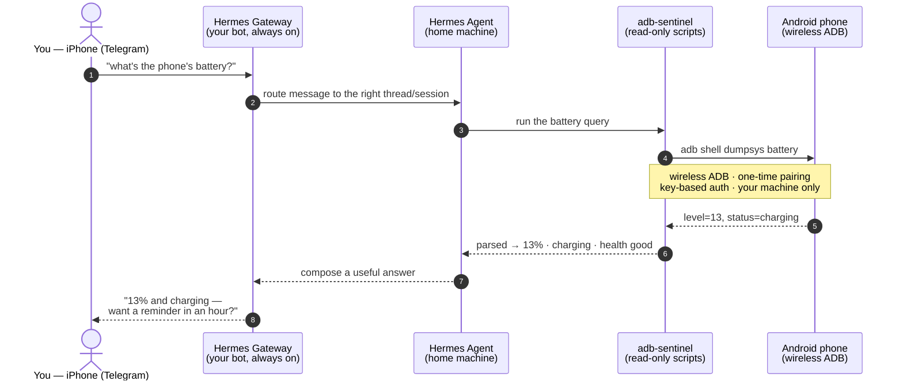

# How a query flows — one question, end to end

You ask from your phone. Your phone answers. Here is everything that
happens in between — no app installed on the Android, no root, no cloud.

## The rules that keep it safe

1. **Read-only.** `adb-sentinel` only ever *reads* the phone's own system
   services (`dumpsys`). One local write exists — the barometric
   calibration anchor — and it never touches the phone's data.
2. **Your machine, your wire.** The only connection is your machine talking
   to a phone you own over wireless ADB. Nothing is proxied through a
   third-party cloud, and no telemetry leaves your network.
3. **Your phone, paired once.** The wireless-debugging pairing is the same
   developer interface Android ships with. Treat it like a key: see
   [SECURITY.md](../SECURITY.md) for what you're exposing and how to lock
   it down.

> The same flow works for storage, temperature, activity, Wi-Fi signal,
> floor detection — anything the phone's own services can report.
> Whatever you can ask `dumpsys`, Hermes can relay to your Telegram.
